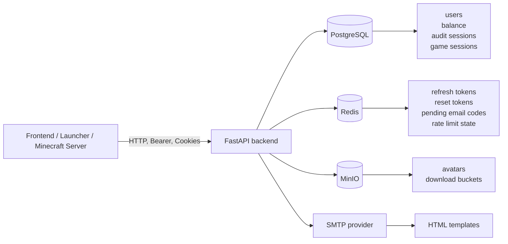

# AiNoCraft Backend

<p align="center">
	
	
	
	
	
	
</p>

<p align="center">
	Backend-сервис AiNoCraft для сайта, личного кабинета, лаунчера и Minecraft/Yggdrasil-совместимой аутентификации.
</p>

## Обзор

AiNoCraft Backend решает три задачи в одном сервисе:

- аккаунты пользователей: регистрация, логин, обновление токенов, смена и сброс пароля;
- игровой API: Yggdrasil-совместимые эндпоинты для Minecraft-клиента и сервера;
- инфраструктурные сервисы: хранение аватаров, отправка почты, rate limit, кеши и аудит сессий.

Проект построен на FastAPI и использует PostgreSQL для основных данных, Redis для сессий и временных токенов, MinIO для файлов и SMTP для писем.

## Архитектура



## Что умеет backend

- Регистрация в 2 шага: `init` -> письмо с кодом -> `verify`.
- JWT-аутентификация с access token в `Authorization` и refresh token в `HttpOnly` cookie.
- Rotation и reuse-detection для refresh token через Redis.
- Сброс пароля по email-коду с отдельным short-lived reset token.
- Принудительный отзыв сессий при смене или сбросе пароля.
- Загрузка аватаров через presigned URL в MinIO.
- Yggdrasil-совместимый игровой auth/session API для Minecraft.
- Alembic-миграции, rate limiting, SMTP-шаблоны и healthcheck из коробки.

## Стек

| Слой | Технологии |
| --- | --- |
| API | FastAPI, Pydantic v2, Uvicorn |
| База данных | PostgreSQL, SQLAlchemy 2, SQLModel, asyncpg, Alembic |
| Сессии и кеш | Redis, fastapi-limiter, cashews |
| Аутентификация | PyJWT, Argon2 (`pwdlib[argon2]`) |
| Хранилище файлов | MinIO |
| Почта | aiosmtplib, Jinja2 |
| HTTP-клиент | httpx |
| Инфраструктура | Docker, Docker Compose |
| Качество кода | Ruff |

## Быстрый старт

### Вариант 1. Локальная разработка текущего кода

Подходит, если вы хотите запускать backend именно из этого репозитория и сразу видеть локальные изменения.

1. Установите Python `3.13` и один из инструментов: `uv` или `pdm`.
2. Скопируйте [`.env.example`](.env.example) в `.env` и заполните секреты.
3. Поднимите только инфраструктурные сервисы:

```bash
docker compose up -d postgres redis minio
```

4. Установите зависимости:

```bash
uvx pdm install
```

Если вы уже работаете через PDM, можно использовать эквивалент:

```bash
pdm install
```

5. Примените миграции:

```bash
uvx pdm run alembic upgrade head
```

6. Запустите API:

```bash
uvx pdm run uvicorn backend.api.app:app --host 0.0.0.0 --port 8000 --reload
```

После запуска будут доступны:

- API: `http://localhost:8000`
- Swagger UI: `http://localhost:8000/docs`
- ReDoc: `http://localhost:8000/redoc`
- Healthcheck: `http://localhost:8000/health`
- MinIO API: `http://localhost:9000`
- MinIO Console: `http://localhost:9001`

> Если нативный запуск на Windows упрётся в зависимости уровня `uvloop`, самый стабильный путь для разработки — Docker Desktop или WSL2.

### Вариант 2. Полный запуск через Docker Compose

Подходит, если нужен быстрый старт всей системы в контейнерах.

1. Скопируйте [`.env.docker.example`](.env.docker.example) в `.env`.
2. Заполните секреты и логины.
3. Запустите стек:

```bash
docker compose up -d
```

4. Проверьте состояние:

```bash
docker compose ps
docker compose logs -f backend
```

> Важно: текущий `docker-compose.yml` использует опубликованный образ `ghcr.io/ainocraft/ainocraft-backend:latest`, а не собирает backend из текущего checkout. Для разработки локального кода используйте вариант 1 или замените `image:` на `build: .`.

## Переменные окружения

В репозитории уже есть готовые шаблоны:

- [`.env.example`](.env.example) — для запуска backend на хосте с локальными сервисами;
- [`.env.docker.example`](.env.docker.example) — для запуска backend внутри Docker Compose.

Ключевые группы переменных:

| Группа | Переменные |
| --- | --- |
| API | `API_SECURE`, `API_MINECRAFT_PATH`, при необходимости `API_DEV_MODE` |
| PostgreSQL | `POSTGRES_HOST`, `POSTGRES_PORT`, `POSTGRES_USER`, `POSTGRES_PASSWORD`, `POSTGRES_DATABASE` |
| Redis | `REDIS_HOST`, `REDIS_PORT`, `REDIS_PASSWORD` |
| Auth | `AUTH_SECRET_KEY`, `AUTH_ACCESS_TOKEN_LIFETIME`, `AUTH_REFRESH_TOKEN_LIFETIME`, `AUTH_RESET_PASSWORD_TOKEN_LIFETIME`, `AUTH_GAME_ACCESS_TOKEN_LIFETIME`, `AUTH_GAME_REFRESH_TOKEN_LIFETIME`, `AUTH_GAME_JOIN_TTL` |
| MinIO | `MINIO_ENDPOINT`, `MINIO_ACCESS_KEY`, `MINIO_SECRET_KEY`, `MINIO_SECURE`, `MINIO_PUBLIC_URL` |
| Avatar | `AVATAR_BUCKET_NAME`, `AVATAR_ALLOWED_TYPES`, `AVATAR_ALLOWED_MIME_TYPES`, `AVATAR_MAX_SIZE` |
| SMTP | `SMTP_HOST`, `SMTP_PORT`, `SMTP_USERNAME`, `SMTP_PASSWORD`, `SMTP_FROM_EMAIL`, `SMTP_FROM_NAME` |

Минимум, без которого сервис не имеет смысла запускать в реальном окружении:

- `AUTH_SECRET_KEY`
- `POSTGRES_*`
- `REDIS_PASSWORD`
- `MINIO_ACCESS_KEY`, `MINIO_SECRET_KEY`
- `SMTP_USERNAME`, `SMTP_PASSWORD`

## Как устроена аутентификация

| Механика | Как работает |
| --- | --- |
| Access token | Возвращается в ответе API и передаётся в `Authorization: Bearer <token>` |
| Refresh token | Хранится в `HttpOnly` cookie `refresh_token` |
| Reset password token | Временный `HttpOnly` cookie `reset_password_token` после подтверждения email-кода |
| Проверка сессий и токенов | Сначала идёт проверка через Redis, а PostgreSQL используется для audit log и связанных fallback/read-path сценариев |
| Аудит сессий | PostgreSQL |
| Безопасность | refresh rotation, reuse detection, отзыв сессий при смене/сбросе пароля |

## Основные API-срезы

### Public/Web API

Базовый префикс: `/api/v1`

| Группа | Эндпоинты |
| --- | --- |
| Регистрация | `POST /register/init`, `POST /register/verify`, `POST /register/resend-code` |
| Авторизация | `POST /login`, `POST /refresh`, `POST /logout` |
| Аккаунт | `GET /balance`, `POST /change-password` |
| Сброс пароля | `POST /reset-password/init`, `POST /reset-password/verify`, `POST /reset-password/finalize` |
| Аватары | `POST /avatars/get-upload-url`, `POST /avatars/avatar-complete`, `GET /avatars/get-avatar` |
| Проверки | `GET /check/login/{login}`, `GET /check/email/{email}` |
| Сервисные | `GET /health` |

### Minecraft API

Базовый префикс: `/minecraft-server-api`

| Группа | Эндпоинты |
| --- | --- |
| Authserver | `POST /authserver/authenticate`, `POST /authserver/refresh`, `POST /authserver/validate`, `POST /authserver/invalidate`, `POST /authserver/signout` |
| Sessionserver | `POST /sessionserver/session/minecraft/join`, `GET /sessionserver/session/minecraft/hasJoined`, `GET /sessionserver/session/minecraft/profile/{uuid}` |

Полная OpenAPI-документация доступна по `/docs`.

## Примеры запросов

### Проверка доступности сервиса

```bash
curl http://localhost:8000/health
```

Ожидаемый ответ:

```json
{
	"status": "ok"
}
```

### Логин пользователя

```bash
curl -X POST http://localhost:8000/api/v1/login \
	-H "Content-Type: application/json" \
	-d '{
		"login": "demo_user",
		"password": "StrongPassword123!"
	}'
```

Ответ вернёт `access_token`, а `refresh_token` будет установлен в cookie.

## Структура проекта

```text
backend/
	api/             # роуты, схемы, зависимости, API-исключения
	config/          # pydantic-settings конфиги
	database/        # провайдеры, таблицы, репозитории
	redis/           # Redis-провайдер и cache services
	minio/           # инициализация и доступ к объектному хранилищу
	smtp/            # почтовый сервис и HTML-шаблоны
	utils/           # JWT, шифрование, HTTP client, profile helpers
migrations/        # Alembic migrations
Dockerfile         # контейнеризация backend
docker-compose.yml # локальный/контейнерный стек
entrypoint.sh      # миграции + запуск uvicorn в контейнере
```

## Полезные команды

```bash
uvx pdm run alembic upgrade head
uvx pdm run uvicorn backend.api.app:app --host 0.0.0.0 --port 8000 --reload
ruff check --fix .
ruff format .
```

Для контейнерной сборки образа из текущего репозитория:

```bash
docker build -t ainocraft-backend-local .
```

## Что стоит помнить

- `Redis` в проекте используется не только как кеш, но и как первый слой проверки для refresh/reset токенов.
- `PostgreSQL` хранит бизнес-данные и audit log сессий, а в части session/token flow участвует и в связанных read-path/fallback-сценариях.
- `MinIO` нужен как минимум для аватаров; публичный URL формируется через `MINIO_PUBLIC_URL`.
- `entrypoint.sh` при контейнерном запуске автоматически прогоняет `alembic upgrade head` перед стартом API.
